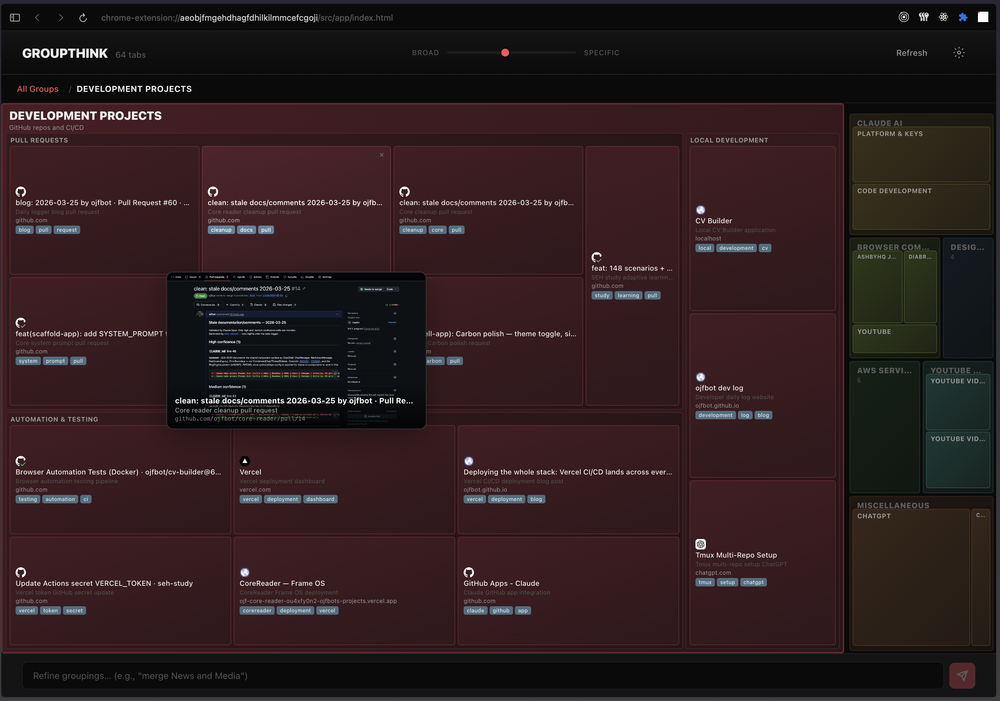

# GroupThink

> LLM-powered tab grouping for AI-first browsers.

GroupThink is a Chrome extension that uses Claude (or local Ollama models) to organize your open tabs by **what you're doing**, not where you are. A YouTube video about React goes in the "Frontend Dev" group, not "YouTube." 64 tabs become 6 meaningful workspaces.



## How it works

1. Press **Alt+Shift+G** (or **Cmd+Shift+K** on Mac) to open GroupThink
2. The extension reads every open tab's title and URL
3. An LLM classifies tabs by topic and intent — grouping semantically, never by domain
4. Results render as an interactive **zoomable d3 treemap** — tiles sized by tab count, color-coded by category
5. Adjust the **specificity slider** (1-10) to control granularity: broad workspace-level groups at 1, fine-grained subgroups at 10
6. **Refine via chat**: type "merge News and Media" or "split React into Components and State" and the LLM restructures on the fly

## Features

- **Semantic grouping** — groups by topic/intent, not by website. "Billing" instead of "AWS + Stripe + QuickBooks"
- **Zoomable treemap** — click into a group to see subgroups and individual tabs. Breadcrumb navigation back out
- **Tab previews** — hover any tab tile to see a thumbnail screenshot and metadata
- **Natural language refinement** — chat bar at the bottom for multi-turn restructuring
- **Specificity control** — slider from broad (3-5 groups) to fine-grained (nested subgroups for 4+ tabs)
- **Dual LLM support** — Anthropic Claude (cloud) or Ollama (local/free: qwen2.5, llama3.1, mistral, gemma2)
- **Browser context enrichment** — optionally uses visit history, bookmarks, and recent sessions for smarter classification
- **Cache-first loading** — shows cached grouping instantly; regroups only on explicit refresh
- **Keyboard shortcut** — Alt+Shift+G / Cmd+Shift+K to open from anywhere

## Architecture

```
popup (browser action)
  └── opens app/index.html in new tab

app (React)
  ├── TreemapView         zoomable d3 treemap visualization
  │   ├── TreemapNode     recursive tile renderer (groups, children, tabs)
  │   ├── TabPreview      hover popover with screenshot thumbnail
  │   └── TreemapBreadcrumb  hierarchy navigation
  ├── SpecificitySlider   1–10 granularity control
  ├── ChatBar             natural language refinement input
  └── TabChaos            loading animation (tabs fly into groups)

background (service worker)
  ├── ai.ts               LLM client (Anthropic + Ollama)
  ├── grouping.ts         post-LLM enforcement, keyword clustering, singleton merging
  ├── prompts.ts          system prompt + per-call prompt builders
  ├── browser-context.ts  visit history, bookmarks, top sites
  └── tabs.ts             Chrome tabs API wrappers
```

All LLM calls happen in the background service worker. The app communicates via `chrome.runtime.sendMessage()` — `ai.ts` is never imported in UI code.

## Tech stack

| Layer | Technology |
|-------|-----------|
| UI | React 18, d3-hierarchy (treemap layout) |
| Build | Vite 5, @crxjs/vite-plugin (Chrome MV3) |
| AI | Anthropic SDK (Claude), Ollama (local models) |
| Validation | Zod |
| Language | TypeScript |
| Linting | Biome |
| Testing | Vitest |

## Getting started

**Prerequisites:** Node >= 20, pnpm 8+, Chrome

```bash
pnpm install

# Configure LLM provider
cp env.json.example env.json
# Add your Anthropic API key, or configure Ollama URL

pnpm build
```

Load the extension:
1. Navigate to `chrome://extensions`
2. Enable **Developer mode**
3. Click **Load unpacked** and select the `dist/` directory

After code changes: `pnpm build`, then click the reload button on the extension card.

## Settings

Open the extension options page to configure:

- **LLM Provider** — Anthropic (cloud) or Ollama (local/free)
- **Model** — Claude Sonnet (default), Claude Opus, Claude Haiku, or local models (qwen2.5, llama3.1, mistral, gemma2)
- **Context enrichment** — Off (title + URL only), Basic (+ visit frequency), Full (+ bookmarks, sessions)
- **Theme** — Light, Dark, or Auto (system preference)

## License

MIT
